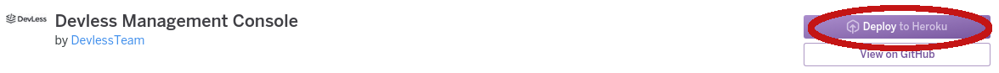
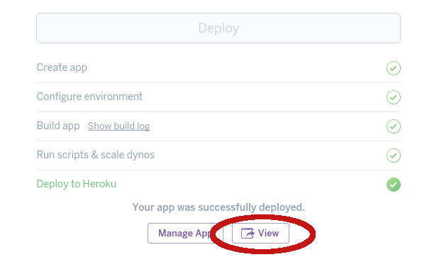

# Quick Start 

Devless is a tool which helps you develop applications easier, by not having to worry about setting up a backend. In these N steps, we will set up a contact list application, with a minimal amount of coding. 

## Step 1: Deploy DevLess to Heroku 

Heroku is a platform as a service that makes hosting web projects easy. You will need an Heroku account to be able to deploy. You won't be charged, since this will fall into [Heroku's free tier](https://blog.heroku.com/heroku-free-dynos). Click the button below to get started. 

Next click this button.

If you don't have an Heroku account, follow the signup process on Heroku.

Next click the view button to get to DevLess.

Register as an admin by entering your email & password:

## Step 3: Set up a service 

A service in devless is a set of functionality that goes together. For example, it could be a contact book, a blog or even something larger as a web shop. We will start easy, with creating a \*\*contact list\*\*. Hit the big, friendly, "create a service" button.

In the following dialog, you only need to fill in the **name and description**. Enter "contacts" as the name, and enter a suiting description. Then, hit create.

## Step 4: Set up a data table

A table is a place where data can be stored. It acts just like a table in e.g. Excel. Set up a table by hitting the new table button:

Let's create a table named **people**. We will create two fields, one for \*\*name\*\* and one for \*\*email\*\*. A field is like a column in a table. It has a name and a type. The types are useful, since it allows DevLess to do automatic validation and optimization for you.

In the table creation form hit the "add a field" button. Add a field called \`name\`, with type \`TEXT\`. Leave the other options at their default values. Add another field field called \`email\`, with type \`EMAIL\`. Again, leave the other options as they are. Then, hit the create table button.

## Step 5: Start using DevLess

You now have a back-end, with a table, up and running! DevLess can now generate a basic html page which interacts with this instance. Press the button looking like this: `</>` to download an html file. 

Try opening this file up in a browser and in an editor. You can use DevLess from this basic web app. Try changing something in the html file and hit refresh in the browser.

Head over to the [Interacting With Devless](interacting.md) to learn of more ways to interact with DevLess. 